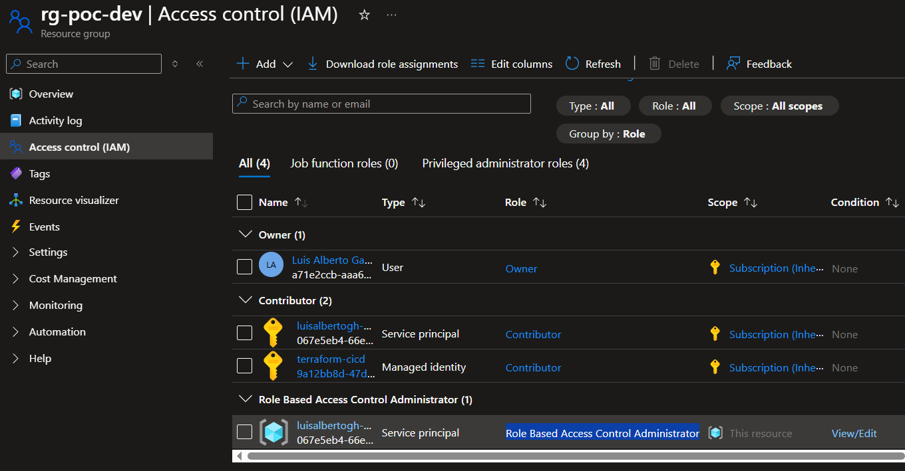

# azure-poc

[](https://github.com/luisalbertogh/azure-poc)
[](https://docs.github.com/en/copilot/how-tos/use-copilot-agents/coding-agent/create-custom-agents?versionId=free-pro-team%40latest&productId=copilot&restPage=reference%2Ccustom-agents-configuration)
[](LICENSE)

This repository contains a couple of POCs related to showcasing authentication against Azure from GitHub workflows and Azure DevOps pipelines, enforcing OIDC (federated credentials). More information can be found in [here](https://medium.com/@luisalbertogh/azure-authentication-from-cicd-pipelines-8111a7274e79).

The idea behind is to demonstrate how to do it, using two different set of resources (App Registration & Managed Identities). The repository is also using Terraform + Terragrunt.

> **DISCLAIMER**
>
> There is no intention to build something production ready here. The used workflows lack of multiple features like branch strategy, templates, environments, etc. Do not use it as a reference for that.

## Azure set up

To use Terraform, the below is first created in Azure:

1. Create new storage account with **public access** for the Terraform backend. **Anonymous access is disabled by default**. Enable Microsoft Entra ID for authorization by default.

> Avoid public access always that possible, or restrict access using ACLs and security groups.

## GitHub workflows

The main steps to create the GH workflow are enumarated below:

1. Create **user managed indentity (MI)**. Grant permissions (*Contributor*) on Subscription. Grant permissions (*Storage Blob Data Contribute*) on storage account with Terraform backend.

2. Create federeated credentials for MI. Specify GH repository and/or branches/environment.

3. Add GH actions secrets with **Client ID, Tenant ID and Subscription ID**.

## Azure DevOps pipelines

The main steps to create the Azure DevOps pipeline are listed out here:

1. Create the **service connection** from Azure Devops. This will create the **app registration** and federated credentials.

2. Grant *Contributor* permissions on the Subscription to the **app registration**. The same for *Storage Blob Data Contribute* on Terraform backend storage account.

> IMPORTANT: to add the app registration to roles, search for app registration name!!!

3. Use the configured **service connection** from the **Azure DevOps pipeline** to authenticate.

## Useful commands

This section contains useful commands to include as part of these pipelines for different purposes.

### Unlock Terraform state

```yaml
- name: Unlock
  uses: gruntwork-io/terragrunt-action@v3
  with:
    tg_dir: 'environments/dev/spaincentral/networking'
    tg_command: 'run force-unlock -- -force <lock-id>'
```

### Azure Function

Before deploying the Azure Function, the `Microsoft.App` provider must be enabled within the subscription:

```
# Register Microsoft.App provider (required for Flex Consumption VNet integration)
az provider register --namespace Microsoft.App --wait
```

More information on resource providers [here](https://learn.microsoft.com/en-us/azure/azure-resource-manager/management/resource-providers-and-types).

### Issue with "azurerm_role_assignment" resources

To assing roles, the pipeline service principle needs `
Role Based Access Control Administrator` permissions on the resource group (or the storage account, etc) where the permissions must be granted. See [here](https://learn.microsoft.com/es-es/azure/role-based-access-control/role-assignments-portal):


